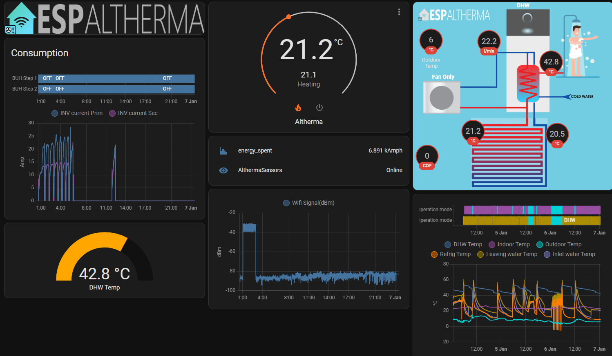
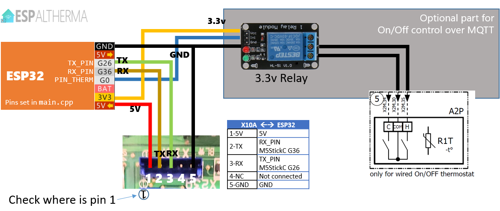
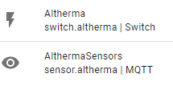
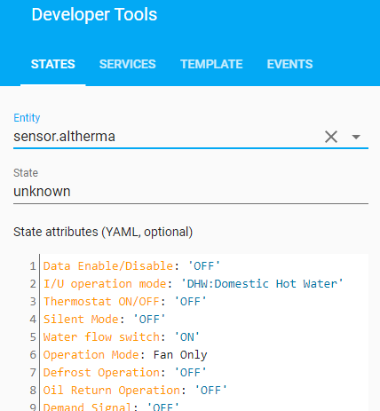
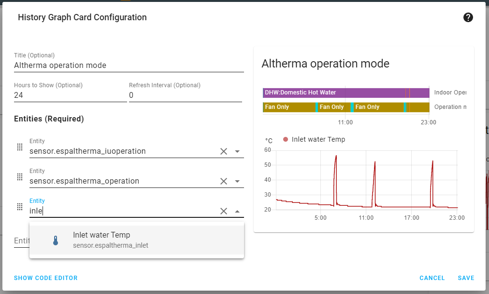

<hr/>

<p align="center">

&nbsp;

&nbsp;
<a href="https://www.buymeacoffee.com/raomin" target="_blank"></a>
</p>

<hr/>


<p><b>ESPAltherma</b> is a solution to monitor Daikin Altherma heat pump activity using just Arduino on an <b>ESP32</b> Microcontroller.</p>

## Features

  <ul style="list-style-position: inside;">
    <li>Connects with the serial port of Altherma on port X10A.</li>
    <li>Needs just an ESP32, no need for extra hardware.</li>
    <li>Queries the Altherma for selected values at defined interval.</li>
    <li>Converts and formalizes all values in an JSON message sent over MQTT.</li>
    <li>Easily integrates with Home Assistant's MQTT auto-discovery.</li>
    <li>Optional: can control (on/off) your heat pump.</li>
</ul>

## Preview



<br/>
<br/>
<br/>


# Getting started

## Prerequisites

### Hardware

- A Daikin Altherma heat pump
- An ESP32 *I used the M5StackC, it fits well next to the board and is properly isolated*
- 5 pins jst PH 2mm connector (or 4 Dupont wires M-F)

### Software

- Platformio

*That's all!*

## Let's get started

### Step 1: Uploading the firmware

1. Download the repository folder and open it in PlatformIO
2. Edit the file `src/setup.h` as follow: 
    - enter your wifi and mqtt settings
    - uncomment the `#include` line corresponding to your heat pump. Eg
  
    ```c++
    ...
    //#include "def/ALTHERMA(HPSU6_ULTRA).h"
    #include "def/ALTHERMA(HYBRID).h" //<-- this one will be used. 
    //#include "def/ALTHERMA(LT-D7_E_BML).h"
    ...
    ```

    *If you're not sure which one to take, choose the closest or Default.h. The only thing that could happen is that you would have missing values or wrong label names.*
3. Now open and edit the file you just uncommented, eg `include/def/ALTHERMA(HYBRID).h` as follow:
    - uncomment each line of the values you are interested in. *Try not to get everything as it will turn into a very big mqtt message*
  
    ```c++
    ...
    LabelDef PROGMEM labelDefs[] = {
    //  {0x00,0,801,0,-1,"*Refrigerant type"},
    {0x60,0,304,1,-1,"Data Enable/Disable"}, //<-- This value will be queried and reported
    // {0x60,1,152,1,-1,"Indoor Unit Address"},
    {0x60,2,315,1,-1,"I/U operation mode"}, //<-- This value will be queried and reported
    {0x60,2,303,1,-1,"Thermostat ON/OFF"}, //<-- This value will be queried and reported
    // {0x60,2,302,1,-1,"Freeze Protection"},
    {0x60,2,301,1,-1,"Silent Mode"}, //<-- This value will be queried and reported
    // {0x60,2,300,1,-1,"Freeze Protection for water piping"},
    ...
    ```
  
4. You're ready to go! Plug in your ESP32 and click -> Upload!

### Step 2: Connecting

1. Turn OFF your heat pump at the circuit breaker.
2. Unscrew your pannel to access the main PCB of your indoor unit.
3. Localize the X10A connector on your the PCB. This is the serial port on the main PCB. It is labeled **X10A**.
4. Using the 5 pin connector or 4 Dupont wires, connect the ESP32 as follow. Pay attention to the orientation of the socket.



| X10A | ESP32 |
| ---- | ----- |
| 1-5V | 5V - VIN *Can supply voltage for the ESP32 :)* |
| 2-TX | `RX_PIN` *Default GPIO 36* |
| 3-RX | `TX_PIN` *Default GPIO 26* |
| 4-NC | Not connected |
| 5-GND | GND |

> ESP `RX_PIN` `TX_PIN` can be changed in `src/main.cpp`. Do NOT use the main Serial GPIOs, it is used for debugging logs.

5. Cross check twice the connections and turn on your heat pump. Two new entities AlthermaSensor and AlthermaSwitch should appear in the  Home Assistant. AlthermaSensor holds the values as attributes.

### Troubleshooting

Possible issues could be: improper wifi signal, unsupported protocol ...

ESPAltherma generates logs on the main serial port (USB). Connect to the ESP32 and open the serial monitor on Platformio.

ESPAltherma also generates logs on MQTT. If Wifi and MQTT is not the issue, look at the logs on the topic `espalterma/log`.

### Note on the TTL voltage

The serial port of X10A is TTL 5V, where the ESP32 is 3.3V. Your ESP32 might not be 5V tolerant. If you want to play it safe, you should use a level shifter to convert Daikin TX - RX ESP line from 5V to 3.3V.

In practice, I had no problem connecting an ESP32 without level shifters.

## Controling your Daikin Altherma heat pump

ESPAltherma cannot change the configuration values of the heat pump (see [FAQ](#faq)). But ESPAltherma includes an MQTT switch that can be connected to a relay to simulate an *external On Off thermostat*. Doing so, allows to remotely turn on/off the heating function of your heat pump. A second relay can be used to trigger the cooling function. 

Refer to the schematic map of your heat pump to see where to connect *external On Off thermostat*.

Adding this will take priority on your thermostat. ESPAltherma will turn the heating on/off, the thermostat will be in standby.

Note: I resoldered the J1 jumper that was cut when installing my digital thermostat (not sure if it is needed).

## Integrating with Home Assitant

ESPAltherma integrates easily with Home Assistant using [mqtt discovery](https://www.home-assistant.io/docs/mqtt/discovery/).

After setup, ESPAltherma will generate 2 entities on Home Assistant:



- `sensor.altherma` holds the values as attributes.

- `switch.altherma` activates the relay connected to the `PIN_THERM`

### Declaring sensor entities

In Home Assistant, all values reported by ESPAltherma are `attribute`s of the `entity` ESPAltherma.



If you want to integrate specific `attribute`s in graphs, gauge etc. you need to declare them as `sensor`s using `template` in your `configuration.yaml`.

Eg. this template declares the 2 operation modes as entities:

```yaml
  - platform: template
    sensors:
      espaltherma_operation:
        friendly_name: "Operation mode"
        value_template: "{{ state_attr('sensor.altherma','Operation Mode') }}"
      espaltherma_iuoperation:
        friendly_name: "Indoor Operation mode"
        value_template: "{{ state_attr('sensor.altherma','I/U operation mode') }}"
```

After restart of Home Assistant, these entities can be added to an history card: 



## FAQ

### Great! I can now monitor my heat pump! Can I change the configuration values too?

Not directly. It might be possible to change registry values using the serial port but I'm not aware of this. If you know, comment on [the dedicated issue](/../../issues/1).

However, ESPAltherma, supports an extra GPIO to control a relay that you can plug as *external On Off thermostat*. See [**Controling your Daikin Altherma heat pump**](#controling-your-daikin-altherma-heat-pump).

If you want to configure your heat pump using an arduino, you can interact with the P1P2 serial protocol (the one of the digital thermostats) using the [nice work on P1P2Serial](https://github.com/Arnold-n/P1P2Serial) of Arnold Niessen.

### Where can I get more info on the protocol used?

It took quite some time to reverse engineering the protocol. If you're interested, I documented my findings [here](doc/Daikin%20I%20Protocol.md).

### Is it safe? Can I break my machine?

It is as safe as playing with your heat pump can be. Use is entirely at your own risk. No liability.

### Why not using the Daikin LAN adapter?

Of course you can probably achieve the same with the BRP069A62 adapter. But it is expensive, not wifi and less fun than doing it yourself :) 

### My Daikin heat pump is not an Altherma. Can I still control it?

No, ESPAltherma supports only Altherma protocol. Other (older) units also have a serial port but using other protocols that would require extra reverse engineering to be implemented.

### How can I contribute?

Every contribution to this project is highly appriciated! Don't fear to create issues to report possible bugs or feature request. Pull requests which enhance or fix ESPAltherma are also greatly appreciated for everybody!

If this project is useful to you, and if you want, <b>you can buy me a beer</b>! It feels good and really helps me keep ESPAltherma updated. Thanks :)

 <a href="https://www.buymeacoffee.com/raomin" target="_blank"></a>

### License
ESPAltherma is licensed under MIT Licence
